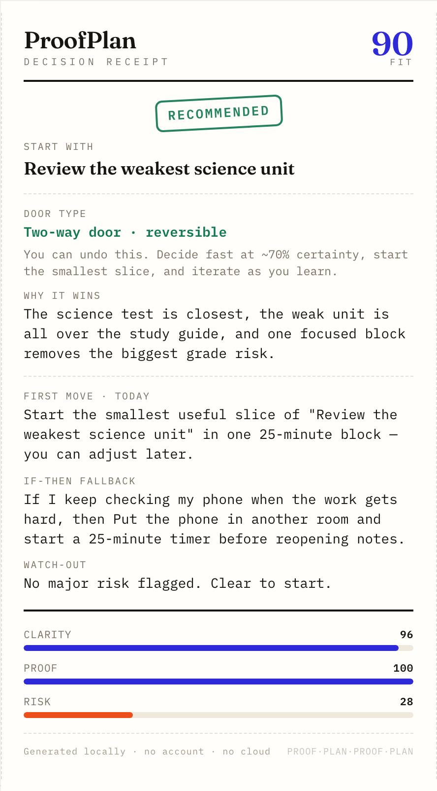
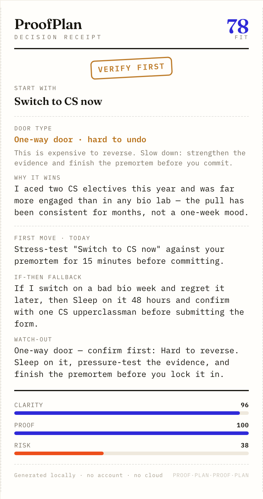

# ProofPlan

### Pick the path. Prove it. Start today.

> **▶ Live demo — [sueun-dev.github.io/proofplan](https://sueun-dev.github.io/proofplan/)** · runs 100% in your browser, no install, no account.

**ProofPlan is a glass-box decision engine for students.** When five things all feel urgent, it tells you which one to start — and prints the proof. You compare your real options on evidence, it classifies the choice as a **two-way door** (decide fast) or a **one-way door** (slow down), and you leave with a **Decision Receipt**: the chosen path, the first move for today, and an if-then fallback for the one thing most likely to break it.

No account. No cloud. No black-box AI — every number is visible and editable.



---

## The problem

Students rarely fail for lack of a to-do list. They stall because **every option feels plausible**, the deadline is close, energy is low, and the plan collapses the moment the first obstacle shows up. Generic productivity apps store tasks; they never make you say *why* one path beats another, or *what you'll do when it breaks*.

ProofPlan lives in that gap — the distance between a decision and the first real action.

## How it works

1. **Frame** the decision in one line, with deadline, energy, stakes, and the time you actually have today.
2. **Compare paths.** Score each on Impact, Confidence, Effort, and Reversibility — then attach the evidence that makes it believable (not a vibe).
3. **Run a premortem.** Assume it already failed; name the likely blockers and pre-decide an if-then fix for each.
4. ProofPlan returns a **ranked recommendation, a door classification, plan checks, and a Decision Receipt** — live, as you type.
5. **Save** to a local decision journal, **copy** a summary, or **export** the receipt as a PNG.

## What makes it different — four ideas from decision science, not productivity theater

ProofPlan isn't another planner or AI brain-dump sorter. Its recommendation is built on four named, citable mechanics:

| Mechanic | What it does | Source |
|---|---|---|
| **Glass-box weighted matrix** | A transparent, *editable* score — Impact 30%, Confidence 20%, Feasibility 20%, Reversibility 15%, Evidence 15%, plus a deadline nudge. Unlike an AI suggestion, you see and can challenge every number. | Weighted decision matrix · decision hygiene, Kahneman, Sibony & Sunstein, *Noise* (2021) |
| **The door test** | Classifies the pick by reversibility. A reversible **two-way door** → decide fast at ~70% and iterate. An irreversible **one-way door** → the app *changes posture*: it stamps "VERIFY FIRST" and tells you to slow down and strengthen the evidence. | Bezos, Amazon shareholder letters |
| **Premortem** | Step 3 assumes the plan already failed — which surfaces materially more failure modes than asking "what might go wrong?" (prospective hindsight lifts reason-finding ~30%). | Premortem: Klein, *HBR* (2007); 30% figure: Mitchell, Russo & Pennington (1989) |
| **If-then implementation intentions** | Each blocker becomes a pre-decided "if X, then Y." A single if-then plan roughly **doubles follow-through** (one study: gym attendance 39% → 91%). | Gollwitzer & Sheeran (2006), 94-study meta-analysis; Milne, Orbell & Sheeran (2002) |

## The artifact: a Decision Receipt

The output is a compact, screenshot-worthy receipt a judge — or future-you — can read in ten seconds. It changes with the decision: a reversible choice is stamped **RECOMMENDED**; an irreversible one is stamped **VERIFY FIRST** with a "slow down" instruction.

| Two-way door → decide fast | One-way door → verify first |
|---|---|
|  |  |

## Design

A deliberately editorial system — built to look crafted, not templated:

- **Type-forward:** Fraunces (display serif) over Inter (UI) over IBM Plex Mono (the receipt's "instrument" voice).
- **Warm paper + ink + a single electric-indigo accent**, with a ruled-grid texture and a thermal-receipt artifact at its heart.
- **Result-first:** on mobile the Decision Receipt appears *before* the long form; on desktop it sits in a sticky rail and updates live.
- Tactile details (perforated receipt edge, dashed rules, an ink-style approval stamp), GPU-only micro-interactions, full `prefers-reduced-motion` support, and no horizontal overflow from 320px up.

## Run it

It's a fully static app — no build step, no backend.

```bash
# from this folder
python3 -m http.server 8027
# then open http://127.0.0.1:8027
```

…or just open `index.html` directly in a browser.

To **export a receipt**: load a scenario chip (or `Load demo`), then click **Export receipt PNG** and download or screenshot it.

## Built with

Vanilla **HTML · CSS · JavaScript**, the **Canvas API** (the Effort×Payoff map and the exported receipt), **localStorage** (the decision journal), and **Google Fonts** (Fraunces · Inter · IBM Plex Mono). Icons are inline SVG. No frameworks, no bundler, no server, no tracking — and it degrades gracefully to system fonts offline.

## Why it fits Design4Future

The brief asks for a practical tool that helps people stay organized, productive, or **make better decisions** in daily life, with a real way to take action. ProofPlan targets that prompt directly: it helps a student make *one* better decision under pressure, see exactly why, and walk away with a concrete first move and a fallback.

## Privacy

100% local. Decisions live in your browser's `localStorage` and never leave the device. There's no account, no analytics, and no network calls except loading web fonts.

## License

Released under the [MIT License](./LICENSE).
